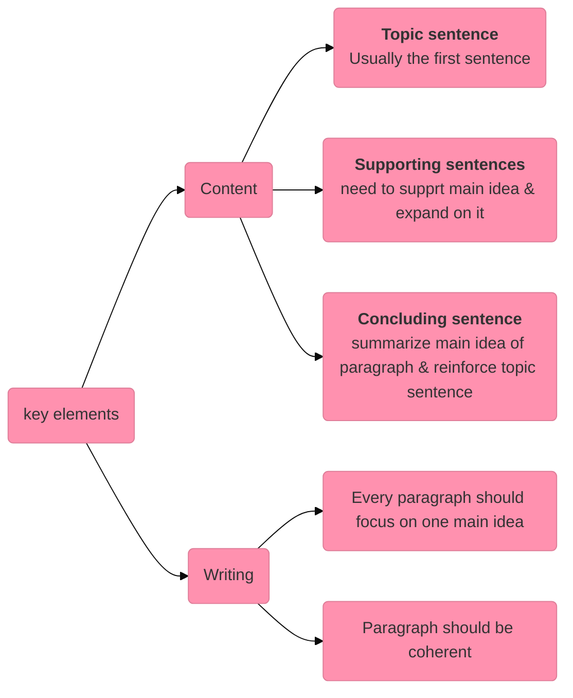

## Goals
Wat aangeduid is, staat in deze samenvatting. Andere dingen zul je uit het boek moeten halen omdat het niet nuttig is dit samen te vatten
- [x] write an engaging and efficient body (various professional contexts)
- [x] write well-structured paragraphs including all elements needed
- [ ] use academic English when writing a paper
- [ ] give a well-structured and clear presentation using signposting and emphasis when needed
- [x] explain the concepts of GDPR, cybersecurity, white hat/black hat hackers, deep web, surface web, dark web and data breaches
- [ ] use conjunctions, prepositions and relative clauses
# SKILLS LAB
## Writing skills - body
### Key features
- **formal & objective tone**
	- avoid opinions, emotions, colloquial language
	- focus on presenting info in clear & impartial manner
	- do not use contractions (e.g. don't, i'm)
	- do not use colloquialisms (a.k.a. informal language)
- **clear & precise language**
	- avoid ambiguity & vagueness
	- sentences should be well-structured
- **use of evidence & citations**
	- to be transparent & give credit to original authors
- **structured organization**
	- introduction
	- thesis statement
	- body paragraphs
	- conclusion
- **objective analysis**
	- evaluate & analyze info and arguments from different perspectives, leading to well-reasoned conclusion
	- don't use 'I', use passive voice
- **cohesion & transitions**
	- strong cohesion between sentences is necessary
	- avoid having too many short sentences
	- use complex sentence structure instead
		- use relative clauses, conjuctions & connectives
- **cridibility & reliability**
	- use reliable sources, do meticulous resaurch & rigorous methodology
### Writing paragraphs

### Collocations
| Collocation | Example |
|-|-|
|**Verb + noun**|to raise a question|
||to give priority|
||to make an effort|
|**Adjective + noun**|a keen interest|
||an invaluable advice|
||a strong possibility|
|**Noun + noun**|a round of applause|
||the service industry|
|**Adverb + verb**|utterly shocked|
||pretty worrying|

# Cybersecurity, White/Black had hacker, Surface/Deep Web, Dark Web, Data Breaches
### **GDPR (General Data Protection Regulation)**:
The GDPR is a European Union law that regulates how companies collect, store, and use personal data. It aims to protect individuals’ privacy by requiring organizations to get explicit consent for data collection, provide transparency, and allow users to access or delete their data. Non-compliance can lead to hefty fines.

### **Cybersecurity**:
Cybersecurity is the practice of protecting computers, networks, systems, and data from theft, damage, or unauthorized access. It involves using tools, techniques, and policies to prevent cyberattacks such as malware, phishing, and hacking.

### **White Hat and Black Hat Hackers**:
- **White Hat Hackers**: Ethical hackers who use their skills to identify and fix security vulnerabilities, helping organizations improve their defenses.
- **Black Hat Hackers**: Malicious hackers who exploit security flaws to steal data, damage systems, or cause harm for personal or financial gain.

### **Deep Web**:
The deep web refers to parts of the internet that are not indexed by search engines like Google. It includes private databases, academic resources, and subscription-based services. Most of it is legal and harmless.

### **Surface Web**:
The surface web is the part of the internet that is publicly accessible and indexed by search engines. It includes websites, blogs, and social media that anyone can find with a simple search.

### **Dark Web**:
The dark web is a small, intentionally hidden part of the deep web that requires special tools like Tor to access. It is often associated with illegal activities like drug trafficking and cybercrime, but it also supports privacy-focused communication.

### **Data Breaches**:
A data breach occurs when sensitive, confidential, or private data is accessed, stolen, or exposed without authorization. This can include personal information, financial records, or business secrets. Breaches are often caused by hacking, weak security, or insider threats.