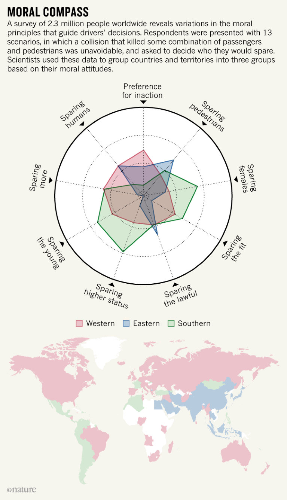

## Goals
Wat aangeduid is, staat in deze samenvatting. Andere dingen zul je uit het boek moeten halen omdat het niet nuttig is dit samen te vatten
- [x] write an abstract in the appropriate style, including all required components
- [ ] present a convincing pitch with a good hook & clear value proposition
- [ ] reflect critically on moral dilemmas within IT (esp. AI)
- [x] describe the role of the software developer when something in the program (code) goes awry and causes damage or hurts people
- [x] name principles of delivering clean code & good software
- [x] explain the trolley problem and apply the principle to autonomous vehicles 
- [x] interpret the moral compass and discuss cultural differences & similarities
- [ ] use the passive voice
# 1 - Ethics in a nutshell
## Collingridge dilemma
about challenge at intersection of tech and society:
- at early stages of tech development, society has limited power to predict & control consequences of a new technology
- as tech becomes more established & integrated into everyday life, it becomes increasingly diffcult to alter shape / course

The paradox of the Collingridge dilemma lies in the contradictory nature of when intervention is possible versus when it is necessary.
## Role software developer when something goes wrong
*describe the role of the software developer when something in the program (code) goes awry and causes damage or hurts people*

Don't say you "had" to do something because of your boss, not a good excuse.

Do what other professions have done in the past: establish set of ethics and set of disciplines before government gets to you. Explain that it wasn't due to negligence because these are the standards that we follow

When disaster occurs, refer to ethics and standards and explain "this is not due to negligence, it's an accident".
## Clean code & good software
*name principles of delivering clean code & good software*

- **stable productivity**
  Don't write bad code when trying to work quickly because you will eventualy slow yourself and everybody who works on it down. Keep the mess out of the code so you can always work at the same speed.
- **inexpensive adaptibility**
  It should be easy to change the code. I'ts called **soft**ware so we can change the behaviour of the system easily
- **continuous improvement**
  The software should get better with time, the code should get cleaner with time. 
  **boy scout rule**: when committing your work, always leave it better as when you found it
- **fearless competence**
  You shouldn't be scared to touch code and maybe break it. If you fear it, you can not clean it. if you cannot clean it, it will rot. Don't lose control over the thing that you created.
  **Solution**: TEST DRIVEN DEVELOPMENT (100% coverage), then you can make sure nothing breaks and can safely make the code cleaner and better.
- **extreme quality**
  Software should work consistently release after release. Track occasional bug down, get them solved and work on them appropriately. There are automates systems to track bugs, but it's not a good idea to normalize this. There should be only a small amount of defects.
- **QA will find nothing**
  Don't rely on QA to find bugs, these should be sought out before. Generaly QA should go through its actions and report no defects.
# 2 - Ethics and AI
## Trolley problem
*explain the trolley problem and apply the principle to autonomous vehicles* 
#### Trolley problem
The Trolley Problem is a thought experiment in ethics, primarily used to explore moral decision-making and utilitarianism.

You are standing next to a railway track. A trolley is heading towards five people who are tied to the track and cannot move. You are beside a lever that, if pulled, will divert the trolley onto another track where only one person is tied. You have to decide whether to:
1. Do nothing, allowing the trolley to continue on its path and kill five people.
2. Pull the lever, diverting the trolley onto the other track, where it will kill one person.
#### Apply principle to automotive cars
Imagine you're driving in your autonomous vehicle on the highway. On every side you're boxed in by other vehices when suddenly large, heavy objects fall from the truck in front of you. You can't stop in time to avoid the collision, so it needs to make a decision:
1. Go straight and hit the object
2. Swerve left into an SUV
3. Swerve right into a motorcicle

Should it:
1. Prioritize your savety by hitting the motorcycle
2. Minimize danger to others by not swerving and maybe sacrificing your life
3. Take the middel road by hitting the SUV, which has a high passenger safety rate

If we were driving the car, our move would be seen as a reaction (with no forethought or malice), compared to a decision by the car.

| Approach | Explanation |
|-|-|
|**Utilitarian Approach** |One solution might program the vehicle to minimize total harm. In the example, the vehicle could be designed to choose the option that results in the fewest deaths (e.g., steering toward the one person). This reflects a utilitarian decision-making process.|
| **Deontological Approach** | Alternatively, an AV could be programmed to follow strict rules that avoid making any decision that would actively harm a person, regardless of the consequences. For instance, it might refuse to make a choice that leads to harm and instead attempt to stop or reduce speed, even if the outcome is still tragic.|

- **Moral Programming**: Autonomous vehicle manufacturers would face the ethical question of who decides what values should be programmed into the vehicle. Should society at large weigh in on these decisions, or should it be left to the manufacturers? Who decides how much value is placed on each life?

## Moral compass
*interpret the moral compass and discuss cultural differences & similarities*

#### Moral compass
There are three main groups of moral orientation when it comes to who they would spare in case of a car accident that has a casualty. This compass illustrates that people don't have a unanimous answer to different moral questions, which means there's no one good way to solve things like the trolley problem and, furthermore, whet decision an autonomous car should make in these scenario's.
#### Cultural differences & similarities

# SKILLS LAB
## Abstract
*write an abstract in the appropriate style, including all required components*
abstract = summary of a paper / thesis
- contains no new info, focus on key info & takeaways
- = concise & complete independent text
- for article $\pm$ 150 words, for bachelor/thesis $\pm$ 250-300 words

### Why
readers can determine if content is relevant for them

### Content
<table>
	<tr>
		<td><ol><li>What is it about.</li><li>Why did you write about it?</li></ol></td>
		<td><ul><li>context + framework for topic = lead-in</li><li>research problem/purpose</li><li>(central) research question</li><li>objectives (aims/purposes)</li></ul></td>
	</tr>
	<tr>
		<td><ol start="3"><li>research conducted?</li></ol></td>
		<td>method (2-3 sentences)</td>
	</tr>
	<tr>
		<td><ol start="4"><li>What are results?</li></ol></td>
		<td>limit to what is relevant for central research questions</td>
	</tr>
	<tr>
		<td><ol start="5"><li>How was research conducted?</li></ol></td>
		<td>discussion (conclusions relevant for central RQ)</td>
	</tr>
</table>

### Good practices
- Be concise
	- keywords
	- to the point
	- focus on one main question
	- don't add new info
- research must be presented in full
- text should be
	- independent
	- understandable
	- no
		- references to own text
		- abbreviations
		- technical terms
		- visuals

## Language use: verb tenses

